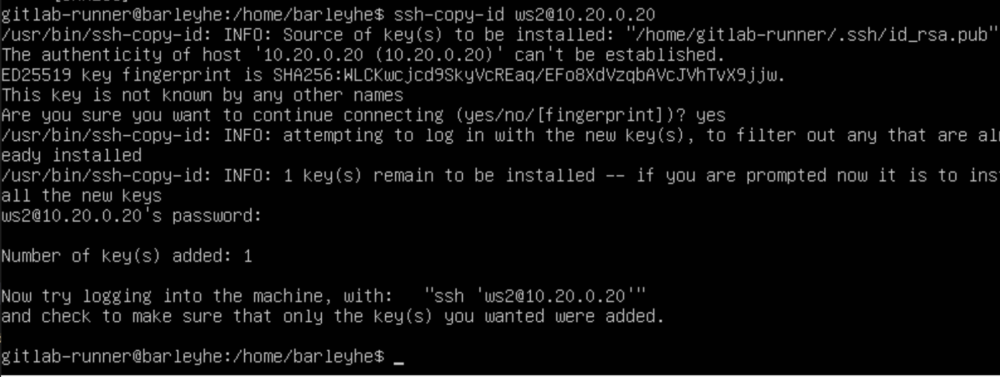

# Basic CI/CD

## Part 1. Настройка gitlab-runner

- Поднимем виртуальную машину Ubuntu Server 22.04 LTS:
    - если нужно обновить до нужной версии выполним следующие команды:\
        - lsb_release –a - узнать версию
        - sudo apt update
        - sudo apt upgrade
        - sudo apt dist-upgrade
        - sudo do-release-upgrade
        - и ждем, соглашаемся (ставим Y).
        - lsb_release –a - проверяем версию

- Скачай и установи на виртуальную машину gitlab-runner:
    - curl -L "https://packages.gitlab.com/install/repositories/runner/gitlab-runner/script.deb.sh" | sudo bash:\
    

    - sudo apt-get install gitlab-runner (sudo apt-get install gitlab-runner=16.5.0 - установка определенной версии)\
    

- Запусти gitlab-runner и зарегистрируй его для использования в текущем проекте (DO6_CICD):\
    
    

- Для регистрации понадобятся URL и токен, которые можно получить на страничке задания на платформе:\
    

## Part 2. Сборка

- В файле gitlab-ci.yml добавь этап запуска сборки через мейк файл из проекта C2, этот файл помести в корневой каталог, и поставь точку перед именем файла. Файлы, полученные после сборки (артефакты), сохрани в произвольную директорию со сроком хранения 30 дней (не забываем установить make: sudo apt install cmake):\
    

    - Результат:\
    

## Part 3. Тест кодстайла

- Напиши этап для CI, который запускает скрипт кодстайла (clang-format - не забудь установить):\
    

- Результат положительный:\
    

- Сделаем ошибку в одном из файлов, чтобы не прошла проверка:\
    
    

## Part 4. Интеграционные тесты

- Напиши этап для CI, который запускает твои интеграционные тесты из того же проекта:
    - Запусти этот этап автоматически только при условии, если сборка и тест кодстайла прошли успешно:\
        
        
        
        
        

- Если тесты не прошли, то «зафейли» пайплайн. Добавим условия в наши тесты (exit 1):\
    - test_cat.sh:\
        
    - test_grep.sh:\
        

- Тесты не прошли, есть ошибки в тестах:\
    
    

- Исправим наши тесты, чтобы в них не было ошибок и посмотрим, что все проходит:\
    
    

## Part 5. Этап деплоя

- Подними вторую виртуальную машину Ubuntu Server 22.04 LTS:
    -  Создаем новую машину и связываем ее с первой:\
        
        

- Прокинем ssh ключ на вторую машину:\
    
    
    

- Дадим доступ к папку /usr/local/bin на второй машине:\
    

- Напиши этап для CD, который «разворачивает» проект на другой виртуальной машине:
    - напишем скрипт, где происходит копирование файлов, которые скомпилировались:\
    
    

- Запусти этот этап вручную при условии, что все предыдущие этапы прошли успешно:\
    

- Запустим в ручную и посмотрим на второй машине, те файлы которые должны скопироваться:\
    

- Посмотрим на второй машине, скопированные файлы:\
    

## Part 6. Дополнительно. Уведомления

- Настрой уведомления о успешном/неуспешном выполнении пайплайна через бота с именем «[твой nickname] DO6 CI/CD» в Telegram:\

    - используем в Telegram "Botfather"

    - Чтобы получить id бота, в браузере: https://api.telegram.org/bot7383376298:AAFI87Z5bREL0MZh4F7JrB0BKgSWhjZPYAI/getUpdates

    - напишем скрипт, который отравляет сообщения в  Telegram:\
    

    - допишем .gitlab-ci.yml, чтобы запускать скрипт:\
    

    - Посмотрим на результат, здесь должно придти сообщение, что все работает:\
    
    
    
    - Сделаем ошибки в тесте, и посмотрим какое сообщение придет:\
    
    

### Вся информация о gitlab есть на сайте https://docs.gitlab.com/